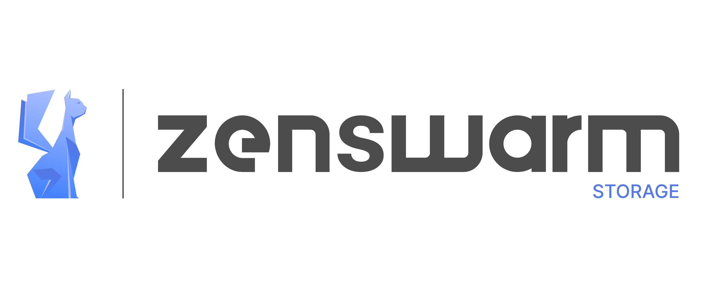

# Zenswarm-storage



**Distributed key-value storage for caching and sharding**

Zenswarm-storage is a distributed caching and sharding offering high availability of data: its nodes are used by applications to store arbitrarily large data objects pegged to a blockchain without, overloading the ledger or blockchain nodes. 

Zenswarm-storage is powered by [Tarantool](https://www.tarantool.io/en/), is deployed via Ansible and includes test and setup scripts.

## Build your first network
First, install [Tarantool cartridge](https://github.com/tarantool/cartridge-cli#installation), then run:

```bash
cartridge build
cartridge start -d
cartridge replicasets setup --bootstrap-vshard
```

Now you can visit http://localhost:8081 and see your application's Admin Web UI.

**Note**, that application stateboard is always started by default.
See [`.cartridge.yml`](./.cartridge.yml) file to change this behavior.

## Application

Application entry point is [`init.lua`](./init.lua) file.
It configures Cartridge, initializes admin functions and exposes metrics endpoints.
Before requiring `cartridge` module `package_compat.cfg()` is called.
It configures package search path to correctly start application on production
(e.g. using `systemd`).

## Roles

Application has two roles, [`app.roles.zenswarm-storage`](./app/roles/zenswarm-storage.lua)
and [`app.roles.zenswarm-router`](./app/roles/zenswarm-router.lua).
It exposes `/hello` and `/metrics` endpoints:

```bash
# STORE
curl -X POST localhost:8081/store -d '{"key": "my-key", "value": {"my": "data"}}'

# RETRIEVE
curl localhost:8081/retrieve/my-key
# OR
curl -X POST localhost:8081/retrieve -d '{"key": "my-key"}'

```

Also, Cartridge roles [are registered](./init.lua)
(`vshard-storage`, `vshard-router` and `metrics`).

You can add your own role, but don't forget to register in using
`cartridge.cfg` call.

## Instances configuration

Configuration of instances that can be used to start application
locally is places in [instances.yml](./instances.yml).
It is used by `cartridge start`.

## Topology configuration

Topology configuration is described in [`replicasets.yml`](./replicasets.yml).
It is used by `cartridge replicasets setup`.

## Tests

Simple unit and integration tests are placed in [`test`](./test) directory.

First, we need to install test dependencies:

```bash
./deps.sh
```

Then, run linter:

```bash
.rocks/bin/luacheck .
```

Now we can run tests:

```bash
cartridge stop  # to prevent "address already in use" error
.rocks/bin/luatest -v
```

## Admin

Application has admin function [`probe`](./app/admin.lua) configured.
You can use it to probe instances:

```bash
cartridge start -d  # if you've stopped instances
cartridge admin probe \
  --name zenswarm-storage \
  --run-dir ./tmp/run \
  --uri localhost:3302
```

-----

# Technical description

Technical description of the internals Zenswarm Storage

## Sharding architecture

The Zenswarm storage is built on a Tarantool cluster. 

The cluster consists of subclusters called "shards", each storing some part of data. Each shard in turn, constitutes a "replicaset" consisting of several replicas, one of which serves as a "master node" that processes all read and write requests.

The whole dataset is logically partitioned into a predefined number of virtual buckets (so called "vbuckets"), to each is assigned a unique identification number ranging from 1 to N, where N is the total amount of vbuckets. 


The amount of vbuckets is specifically chosen to be several orders of magnitude larger than the potential amount of cluster nodes, even given future cluster scaling. For example, with M projected nodes the dataset may be split into 100 * M or even 1,000 * M vbuckets. 
Choosing the correct amount of vbuckets is crucial, the trade-off is: 
- if buckets are too many, extra memory/storage resources for storing the routing information may be required 
- if buckets are too few, a decrease in the granularity of rebalancing may be experienced. 

The right strategy may vary for different pilot use cases, generically in our tests the number of buckets (specially on the IPR usecase) are tweeked to allow a generic flexibility and balance allowing performance on write speed and good speed response on data read. 

While a generic setup of the sharding engine can be beneficial, the technology allows for several clusters to co-exist on the same Zenswarm Oracle, where each replica functions based on its own rules and roles, where "role" contains the business logic to work with the data. 
For reference see [the current configuration](https://github.com/dyne/zenswarm-storage/blob/main/replicasets.yml).

Each shard than stores a unique subset of vbuckets, meaning that a vbucket cannot belong to several shards at once, as illustrated below:

```
vb1 vb2 vb3 vb4 vb5 vb6 vb7 vb8 vb9 vb10 vb11
    sh1         sh2        sh3       sh4
```


This shard-to-vbucket mapping is stored in a table in one of Tarantool’s system spaces called "mapping table", with each shard holding only a specific part of the mapping that covers those vbuckets that were assigned to this shard.

The vbucket id is also stored in a field of a every data containar participating in the sharding, this data container is also organized in a table.

Once a shard receives any request (except for SELECT) from an application, this shard checks the bucket id specified in the request against the mapping table, to see if the bucket belongs to a given node. If the
specified bucket id is invalid, the request gets terminated. Otherwise the request is executed, and all the data created in the process is assigned the bucket id specified in the request.

Storing bucket ids both **in the data itself and the mapping table ensures data consistency** regardless of the application logic and makes rebalancing transparent for the application. Tarantool stores a mapping table in a "system space" that ensures **sharding is performed consistently in case of a failover**, as all the replicas in a shard share a common table state.

## Router

On their way from the application to the sharded cluster, all the requests pass through a separate Tarantool component called "router" that is deployed inside each Zenswarm node. The router's main function is to hide the cluster topology from the application, namely:

* the number of shards and their placement;
* the rebalancing process;
* the occurrence of a failover caused by the shutdown of a replica
* the connection pooling through storage replicasets

A router can also calculate a bucket id on its own provided that the application clearly defines rules for calculating a bucket id based on the request data. To do it, a router needs to be aware of the data schema.


The router exposes also an entry point as a single REST address to allow to interact with the distributed storage. Namely the access point of interact with the storage, in the same fashion of the EBSI infrastructure defined for the StorageAPI and the off-chain Storage service.  

A router is stateless and doesn’t store the cluster topology. Nor does it rebalance data.
A router is a separate program component that can be implemented both in the storage and application layers, and its placement is application-driven.

A router maintains a constant pool of connections to all the storages that is created at startup. Creating it this way helps avoid configuration errors. Once a pool is created, a router caches the current state of the \_vbucket table to speed up the routing. In case a bucket id is moved to another storage as a result of data rebalancing or one of the shards fails over to a replica, a router updates the routing table in a way that's transparent for the application.


Sharding is not integrated into any centralized configuration storage system. It is assumed that the application itself handles all the interactions with such systems and passes sharding parameters. That said, the configuration can be changed dynamically - for example, when adding or deleting one or several shards:

1. to add a new shard to the cluster, a system administrator first changes the configuration of all the routers and then the configuration of all the storages;
2. the new shard becomes available to the storage layer for rebalancing;
3. as a result of rebalancing, one of the vbuckets is moved to the new shard;
4. when trying to access the vbucket, a router receives a special error code that specifies the new vbucket location.

#### CRUD (create, replace, update, delete) operations
All the application operations (eg. CRUD) are intended to been defined at configuration time inside the Zenbridge oracle. In any case, the application must include the operation bucket id in a request. When executing an INSERT request, the operation bucket id is stored in a newly created tuple. In other cases, it is checked if the specified operation bucket id matches the bucket id of a tuple being modified.

#### SELECT requests
Since a Zenbridge distributed storage is not aware of the mapping between a bucket id and a primary key, all the SELECT requests executed in stored procedures inside a storage are only executed locally. Those SELECT requests that were initialized by the application are forwarded to a router. Then, if the application has passed a bucket id, a router uses it for shard calculation.


## Replicaset balancing algorithm

The main objective of balancing is to add and delete replicasets as well as to even out the load based of physical capacities of certain replicasets.

For balancing to work, each replicaset can be assigned a weight that is proportional to its capacity for data storage. The simplest capacity metric is the percentage of vbuckets stored by a replicaset. Another possible metric is the total size of all sharded spaces in a replicaset.

Balancing is performed as follows: all the replicasets are ordered based on the value of the M/W ratio, where M is a replicaset capacity metric and W is a replicaset weight. If the difference between the smallest and the largest value exceeds a predefined threshold, balancing is launched for the corresponding replicasets. Once done, the process can be repeated for the next pair of replicasets with different policies, depending on how much the calculated metric deviates from the cluster mean (for example, the minimum value is compared with the maximum one, then with the second largest and so on).

With this approach, assigning a zero weight to a replicaset would allow evenly distributing all of its vbuckets among other cluster nodes, and adding a new replicaset with a zero load would result in vbuckets being moved to it from other replicasets.

In the migration process, a vbucket goes through two stages at the source and the receiver. At the source, the vbucket is put into the sending state, in which it accepts all the read requests, but declines any write requests. Once the vbucket is activated at the receiver, it is marked as moved at the source and declines all requests from here on.

At the receiver, the vbucket is created in the receiving state, and then data copying starts, with all the requests getting declined. Once all the data is copied over, the vbucket is activated and starts accepting all requests.

If a node assumes the role of a master, all the vbuckets in the sending state are checked first. For such vbuckets, a request is sent to the destination replicaset, and if a vbucket is active there, it is deleted locally. All the vbuckets in the receiving state are simply deleted.

# Links

[Tarantool Glossary](https://www.tarantool.io/en/doc/latest/reference/reference_rock/vshard/vshard_architecture/#glossary)
[Tarantool Documentation](https://www.tarantool.io/en/doc/latest/)
